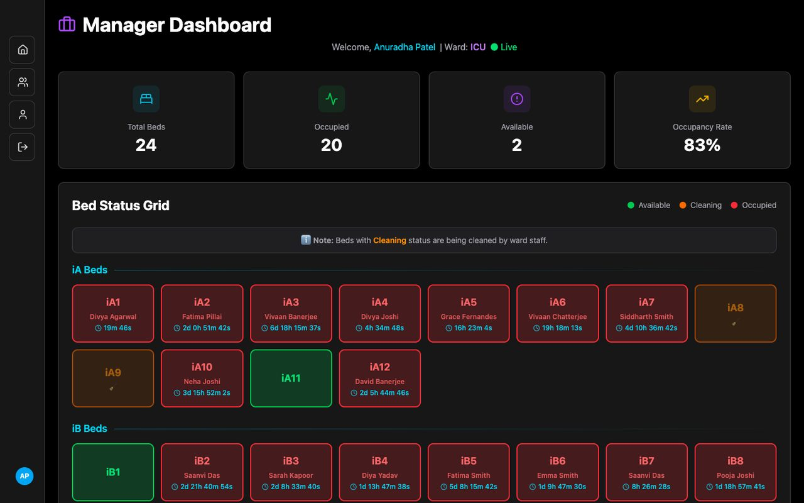
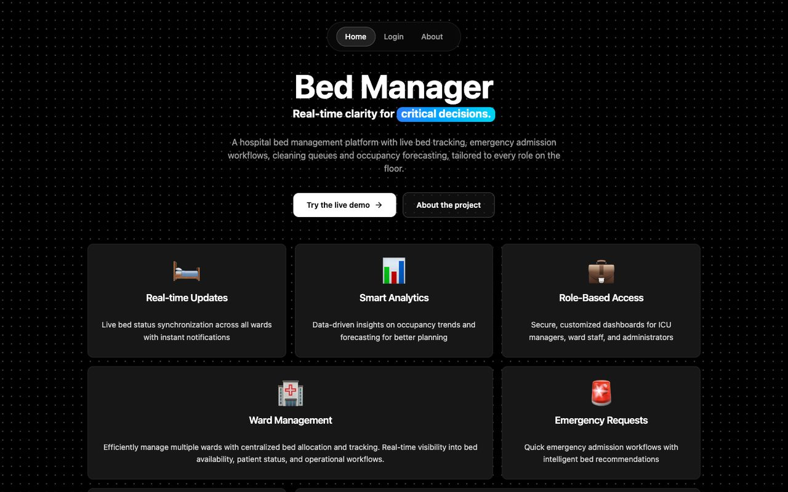
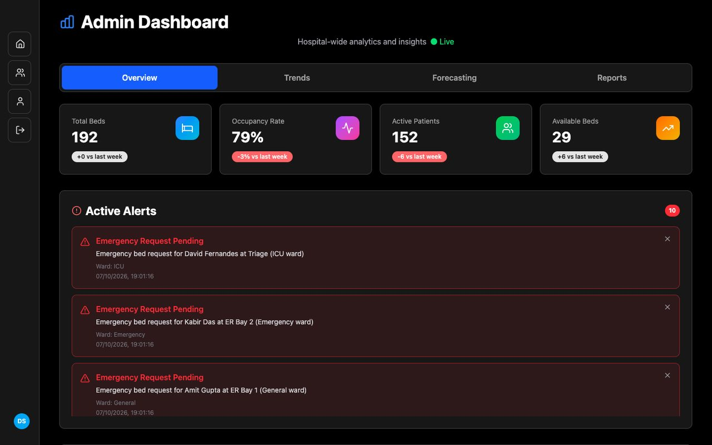

# Bed Manager

**Live demo: https://bed-manager-system.vercel.app** (use the one-click demo accounts on the login page)

Real-time hospital bed management. Bed Manager gives every role on the hospital floor a live view of bed availability, and connects the people who need a bed (ER staff) with the people who manage them (ward managers and staff).



## Features

- **Role-based dashboards** for hospital admins, ward managers, ward staff and ER staff, each limited to the data and actions that role needs
- **Live bed grid** covering 192 beds across ICU, General and Emergency wards, with patient assignment, discharge planning and status changes
- **Emergency admission workflow**: ER staff raise bed requests, the ward manager is notified immediately and approves or rejects them
- **Cleaning queue** with estimated durations, progress tracking and overdue detection
- **Analytics**: occupancy trends, ward utilization, cleaning performance and peak-demand analysis
- **Forecasting**: per-bed discharge predictions and a day-by-day occupancy projection built from expected discharges and historical admission patterns
- **Reports** as PDF or CSV (comprehensive, occupancy, financial, performance), with history stored in the database
- **Real-time updates** over Socket.IO, with an automatic polling fallback when WebSockets are not available
- **Responsive UI** that works on phones and tablets for staff on the move

| Landing page | Admin analytics |
| --- | --- |
|  |  |

## Tech stack

| Layer | Technology |
| --- | --- |
| Frontend | React 19, Vite, Redux Toolkit, React Router, Tailwind CSS 4, Radix UI, Framer Motion |
| Backend | Node.js, Express 5, Mongoose, Socket.IO, JWT authentication, PDFKit |
| Database | MongoDB |
| ML service (optional) | Python, FastAPI, scikit-learn |
| Hosting | Vercel (static frontend + serverless API), MongoDB Atlas |

## Project structure

```
api/            Vercel serverless entry point (wraps the Express app)
backend/        Express API, Socket.IO server, Mongoose models, seed script
frontend/       React single-page app
ml-service/     Optional FastAPI microservice with trained prediction models
docs/           API notes and screenshots
vercel.json     Build, routing and function configuration for Vercel
```

`backend/app.js` exports the Express app without starting a server. It is used in two ways:

- `backend/server.js` runs it as a long-lived process and adds Socket.IO and scheduled jobs (local development, Render, Railway, a VM)
- `api/index.js` exposes it as a serverless function on Vercel, where the frontend keeps itself up to date by polling

## Demo accounts

The seed script creates these accounts. They all use the password `demo1234`, and the login page has one-click buttons for the first four.

| Role | Email | What you can do |
| --- | --- | --- |
| Hospital admin | `admin@hospital.com` | Hospital-wide analytics, forecasting, reports |
| ICU manager | `manager.icu@hospital.com` | Manage ICU beds, approve emergency requests, plan discharges |
| Ward staff (General) | `staff.general@hospital.com` | Update bed status, work through the cleaning queue |
| ER staff | `er@hospital.com` | Check availability, request emergency admissions |

Managers and ward staff also exist for the other wards (`manager.general@`, `manager.emergency@`, `staff.icu@`, `staff.emergency@hospital.com`). Demo accounts have read-only profiles and cannot be deleted. Sign up for your own account to try profile editing.

## Running locally

Requirements: Node.js 20 or newer and a MongoDB instance (local or Atlas).

```bash
# 1. Install dependencies
npm run install:all

# 2. Configure the backend
cp backend/.env.example backend/.env      # then set MONGO_URI and JWT_SECRET

# 3. Load the demo data (wipes the app's collections first)
npm run seed

# 4. Start the API (http://localhost:5001) and the app (http://localhost:5173)
npm run dev:backend
npm run dev:frontend      # in a second terminal
```

The Vite dev server proxies `/api` and `/socket.io` to the backend, so the frontend needs no environment variables in development.

## Deploying to Vercel

The repository deploys as a single Vercel project: the frontend is served as static files and the API runs as a serverless function on the same domain.

1. **Create a database.** Create a free MongoDB Atlas cluster, add a database user, and allow access from anywhere (`0.0.0.0/0`) under Network Access, since Vercel functions do not have fixed IP addresses. Copy the connection string and put the database name `bedmanager` in it.
2. **Seed it** from your machine:
   ```bash
   MONGO_URI="mongodb+srv://..." npm run seed
   ```
3. **Import the repository** in Vercel. Keep the root directory as the repository root. `vercel.json` already defines the install command, build command, output directory and routes.
4. **Add environment variables** in the Vercel project settings:

   | Variable | Value |
   | --- | --- |
   | `MONGO_URI` | Your Atlas connection string |
   | `JWT_SECRET` | A long random string |

5. **Deploy.** Open the site and sign in with a demo account.

### What differs on Vercel

Serverless functions cannot hold WebSocket connections or run background jobs, so on Vercel:

- The app polls the API every 15 seconds instead of using Socket.IO. New emergency requests, bed changes and alerts still appear on their own, a few seconds later than with sockets.
- Scheduled report emails do not run. Reports can still be generated and downloaded on demand.

### Optional: instant updates and ML predictions

To get instant updates in production, also run the backend as a long-lived process (for example on Render or Railway, start command `npm start` in `backend/`) and set these variables on the Vercel project before redeploying:

| Variable | Value |
| --- | --- |
| `VITE_API_BASE_URL` | `https://<your-backend>/api` |
| `VITE_SOCKET_URL` | `https://<your-backend>` |

Set `FRONTEND_URL` on that backend to your Vercel URL so it accepts cross-origin requests.

Predictions come from statistical estimates over the hospital's own history by default. To use the trained models instead, deploy `ml-service/` (see its README) and set `ML_SERVICE_URL` on the backend. The UI labels predictions as "ML Model" or "Historical Model" depending on which source produced them.

## Environment variables

| Variable | Where | Required | Purpose |
| --- | --- | --- | --- |
| `MONGO_URI` | backend | yes | MongoDB connection string |
| `JWT_SECRET` | backend | in production | Secret used to sign login tokens |
| `PORT` | backend | no | Port for `server.js` (default 5001) |
| `FRONTEND_URL` | backend | no | Extra allowed CORS origins, comma separated |
| `ML_SERVICE_URL` | backend | no | URL of the FastAPI ML service |
| `SMTP_HOST`, `SMTP_PORT`, `SMTP_USER`, `SMTP_PASS`, `SMTP_FROM` | backend | no | Enables emailing reports |
| `VITE_API_BASE_URL` | frontend | no | API base URL when it is not on the same origin |
| `VITE_SOCKET_URL` | frontend | no | Socket.IO server URL for instant updates in production |

## API overview

All routes are under `/api` and, except for login, registration and the health check, require a `Authorization: Bearer <token>` header.

| Area | Routes |
| --- | --- |
| Auth | `POST /auth/register`, `POST /auth/login`, `GET /auth/me`, `DELETE /auth/account` |
| Beds | `GET /beds`, `GET /beds/occupied`, `GET /beds/cleaning-queue`, `PATCH /beds/:id/status`, `PUT /beds/:id/cleaning/mark-complete`, `PATCH /beds/:id/discharge-time` |
| Emergency requests | `GET` and `POST /emergency-requests`, `PATCH /emergency-requests/:id/approve`, `PATCH /emergency-requests/:id/reject` |
| Alerts | `GET /alerts`, `PATCH /alerts/:id/dismiss` |
| Analytics | `GET /analytics/occupancy-summary`, `/occupancy-by-ward`, `/occupancy-trends`, `/occupancy-forecast`, `/forecasting`, `/cleaning-performance`, `/ward-utilization`, `/peak-demand-analysis` |
| Reports | `POST /reports/generate/pdf`, `POST /reports/generate/csv`, `GET /reports/history`, `GET /reports/download/:fileName` |
| Profile | `GET` and `PUT /profile`, `DELETE /profile/picture` |

More detail on the analytics endpoints is in [docs/ANALYTICS_API.md](docs/ANALYTICS_API.md).

## Team

Built by Team 25: Diganta Sen, Shubham Kumar Sunny, Surjit Mandal, Nilkanta Karak and Abhinav Borah.
